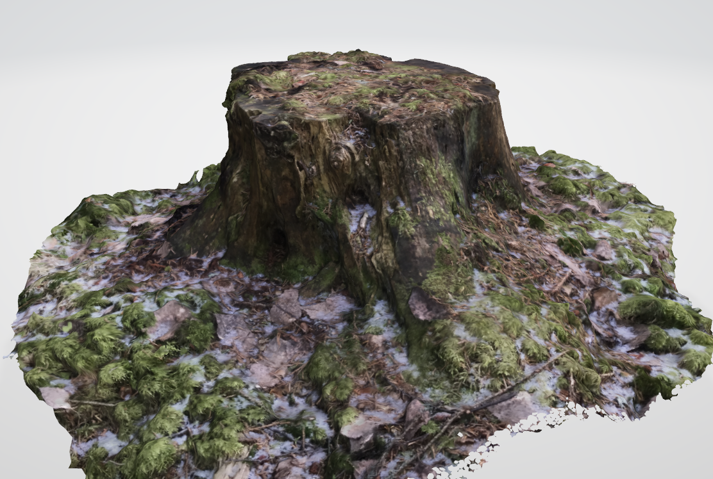

# 3D model of a stump

* Took photos of the stump
* Imported photos to Meshroom
* Deleted photos that were blurry or not in focus
* Made the model with meshroom
* Imported the model to Blender, added textures and deleted extra mesh

